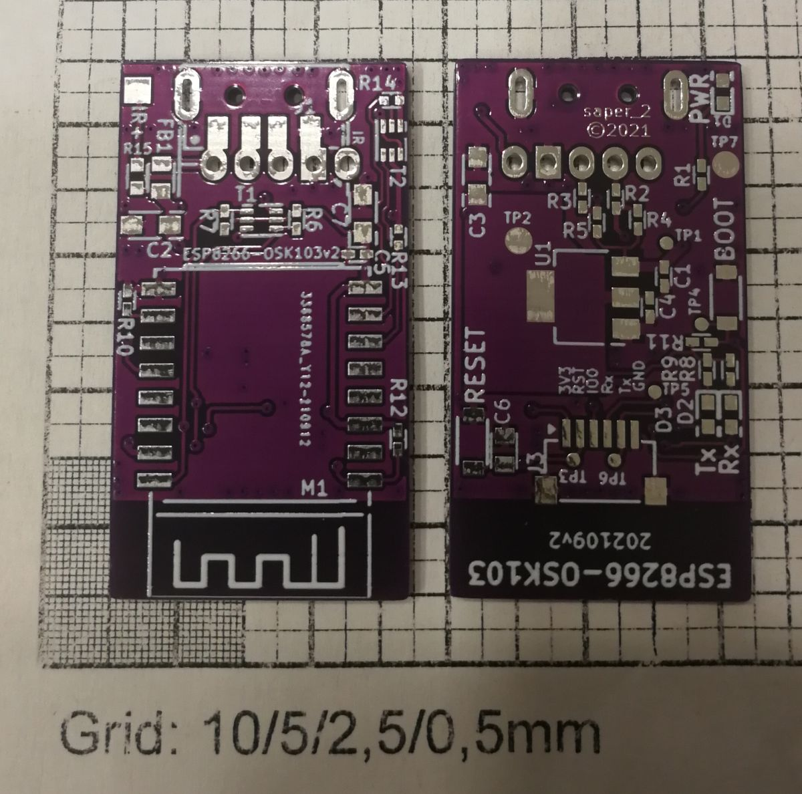
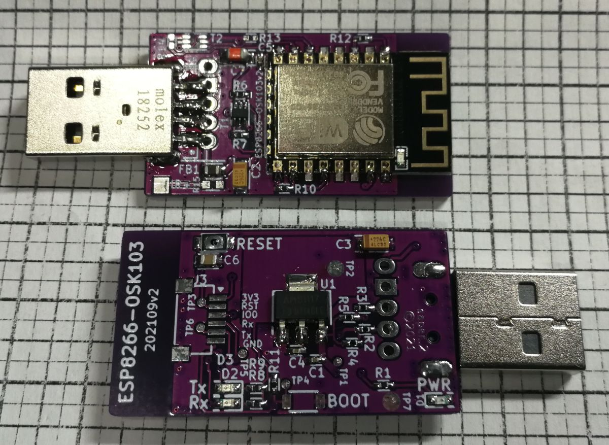
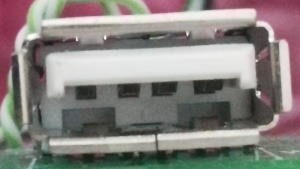
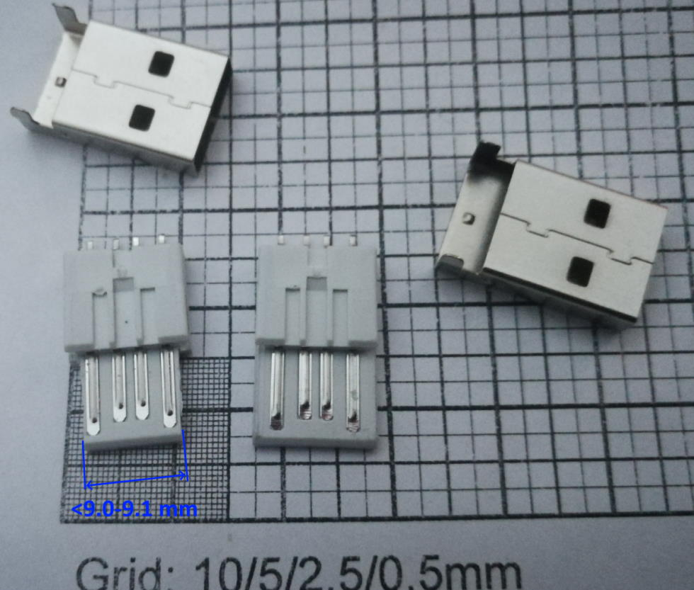
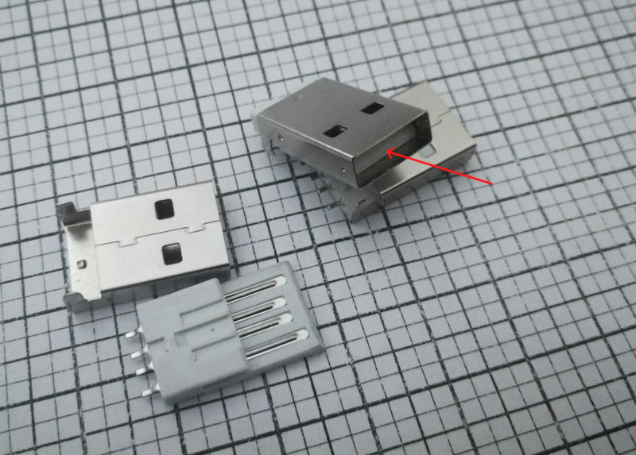
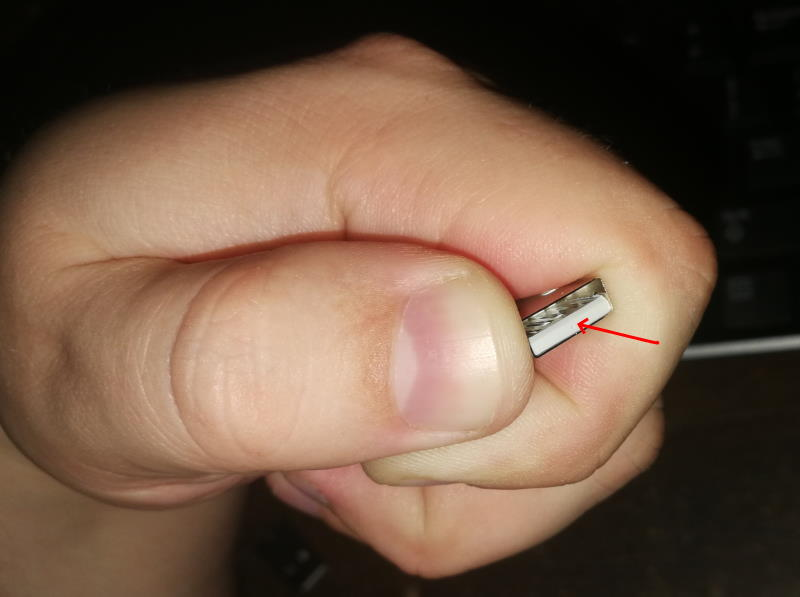

# Rotenso ESP8266-OSK103

This is basically a my version of Sergey's [IoT-Uni-Dongle](https://github.com/dudanov/iot-uni-dongle) . I have created this for my Rotenso branded A/C (and any other A/C that take OSK103 or newer OSK105 wifi module). 

---
**Why**
Someone who see this first time will think **Why**. First, for me it is: **I DO NOT TRUST CHINESE CLOUD**, why I would potentially let someone into my network? Even if those modules don't have this kind of "feature" (supposedly :upside_down_face:). 

E.g.: for hackers that got into manufacturer servers would be then simple to remotely upload firmware that would create encrypted tunnel from their server to inside my home network. Well, someone can say this won't happen, but I in last year, I read about chinese server hacked and that company stayed quiet about it, until stolen data made into black market and started popping up everywhere...

And, there is another much simpler reason: when my internet connection fail then those "cloud-based" solution go to hike... You can't control them via phone being in home (and looking for remote in this case can be PITA :sweat_smile: ), but with custom module that connect to your local server (HomeAssistant, or MQTT, ...) you still in control :grin: 

---

There is not much to write about the module circuit it basically that same. I have made PCB so it can be used with USB male SMT plug, or pinheader/goldpin or JST 2.5mm 4pin (or 5pin if IR is used) or wires just soldered to it. I placed a small 6pin 1mm connector for potential programming, and also testpoint pads that are used by designed especially for this module Programming Rig (cradle).

It's 2nd revision - don't ask about 1st one :upside_down_face:




---

# Part List

## Module

See notes under the list too.

REF | QTY | VAL | Footprint | P/N
--- | --- | --- | --- | ---
C1 C4 | 2 | 100n | C_0402_HS | |
C2 C3 | 2| 22/10V| CP_3216-HS
C5 | 1| 1u| C_0402_HS
C6 | 1| 470p| C_0805_HS
C7 | 1| 15/6,3V| CP_3216-HS
D1 | 1| G| LED0603_HS
D2 | 1| Or| LED0603_HS
D3 | 1| Y| LED0603_HS
FB1 | 1| Z600| R_0805_HS|
J1 | 1| *notes*| 
J2 | 1| *notes*| 
J3*| 1| *notes*| 
M1 | 1| ESP-12E| ESP-12E
R1 R8 R9 | 3| 4k3| R_0402_HS
R10 R12 | 2| 10k| R_0402_HS
R13* R14* | 2| 10k| R_0402_HS2
R15* | 1| 470R| R_0603_HS
R2 R3 | 2| 22R| R_0402_HS
R4 R5 R6 R7 R11 | 5| 22k| R_0402_HS
SW1, SW2| 2| BOOT, RST| KXT321LHS| (C&K) KXT321LHS
T1 T2* | 2| RK7002DW| SC-70-6_HS
U1 | 1| 1117-33| SOT-223-3

***Notes:***
**Install either J1 or J2 only.**


J1: it can be goldpin 4 or 5pin (if you want IR too) or JST 2.5mm socket (4/5pin), or just solder wires directly to pads.

J2: It is USB male SMD plug that fit footprint of Molex ```48037-2200``` - so basically most of USB SMD plugs should fit, but if you have key in socket in your AC read further for fixing the usb plug to fit keyed socket.

J3 - optional, this is for programming/debugging - I have used 6pin 1mm pitch SMT right angled socket (JST code: ```SM06B-SRSS-TB(LF)(SN)``` but any similar will do: ```JS-1254R-06``` or ```WE06DH``` )

**No IR Version**
You can skip ```R13..R15 & T2``` - those are only for IR support (tapping into IR receiver).

**IR version**
You can tap into IR receiver on display board - then R15 is not needed.

Or you can add a small IR diode if you don't want to mess with your display board:
``` [pad_IR+]---[A]-|>|-[C]---[IR_pad] ```

*A - IR diode anode , C - IR diode cathode*

## Rig / Cradle

Not much of list :smile: :
* Ppring test probe socket: ```R50-2C``` - 7pcs ,
* Sprint test probe: ```P50-E2```- 7pcs ,
* Goldpin 1x7 - 1pcs ,
* Goldpin 1x2 - 1pcs ,
* Goldpin 1x3 - 1pcs ,
* Jumper bridge - 1pcs .

---

# Assembly

## ESP8266-OSK103
If you not need to tap into IR then you can just skip: ```R13, R14, R15, T2``` . BOOT button is optional too.

### Hacking USB plug

For USB connector you have to check your AC, if you have special "keys" in usb socket:


Then you have to disassembly USB plug before soldering and cut-up a bit of the plastic:

It should have not more than 9.00-9.1mm width after cut.

To remove the insert grab the plug and push-out the insert with flat screwdriver:
 
Holding it like that make it much easier to push out.

Then use sharp knife, file or even mill if you have (then you don't need to mill down all the plastic, you can leave about 1..2mm from bottom :smile: ) to remove sides of the insert front part (with contacts).

## Programming Rig

I have used spring test probes (you can find it also under name: spring pogo pins):

Everything was printed on Ender 3 (v1) layer 0.12mm/nozzle 0.4mm .
Only the: arm, top part and bottom spring retainer had a higher infill (about 50-60%). Top part was printed with at least 3 walls (or 4 - don't remember exactly :sweat_smile: )
Arm was printed on side with "everywhere support" enabled .

STLs you can grab from Thingiverse: [ESP8266-OSK103 Programing Cradle](https://www.thingiverse.com/thing:5463984)

For soldering spring probes sockets to the rib pcb, I used 2nd rig pcb, and placed it on some spacers (~10mm) from 1st, then screwed down this to base, and then inserted the sockets. And making sure that they are straight, with hot solder iron that have on tip a melted tin , I quickly soldered socket to 1st board pad - be quick to not melt the base plastic where spring probe socket sits in guide in base part.

After that, just remove 2nd board and you can end soldering cradle board and push in spring probes.

For assembling I used few screws for metal: 3x6, 3x10 , and few M3: M3x10 , M3x12 and M3x20 + 2 M3 nuts (just what I have lying around).

# Other notes

In ```3d``` you'll find the design files for cradle - it was done in Design Spark Mechanical.

In ```pcb`` you''' find all PCB design files, PDFs with schematics and BOMs, also gerber files for pcb fab too.

I am sorry all English speaking people for messing up with ```cradle``` word - I often swap the letters :sweat_smile: sorry :pleading_face: 

In ```photos``` there is few more photos how this looks like.

# EOF
